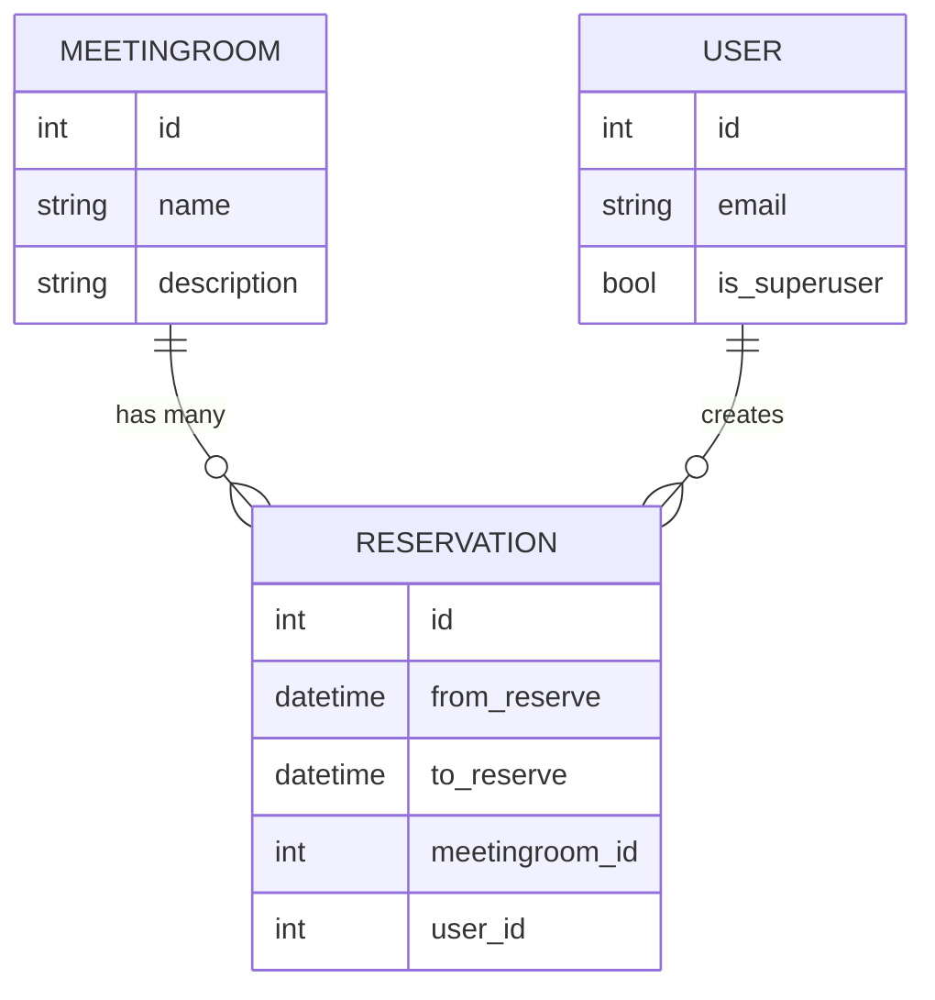

# API бронирования переговорок

Асинхронный сервис на FastAPI для управления переговорными комнатами и бронированиями. Проект предоставляет REST API с аутентификацией по JWT, валидацией входных данных и проверкой пересечений во времени.

## Возможности

- регистрация и аутентификация пользователей через FastAPI Users (JWT-токены);
- автоматическое создание первого суперпользователя при старте приложения;
- CRUD-операции с переговорными комнатами (создание и изменение доступны только суперпользователям);
- создание, изменение и удаление собственных бронирований с проверкой пересечений во времени;
- просмотр всех переговорных комнат и будущих бронирований по комнате;
- получение списка собственных бронирований и, для суперпользователей, полного списка бронирований.

## Технологический стек

- Python 3.10+
- FastAPI, Pydantic, FastAPI Users
- SQLAlchemy 1.4 (async engine) и aiosqlite
- Alembic для миграций
- Uvicorn и watchgod для запуска и hot reload
- python-dotenv для работы с переменными окружения

Полный список зависимостей доступен в `requirements.txt`.

## Подготовка окружения

1. **Создать и активировать виртуальное окружение**

   ```bash
   python -m venv venv
   source venv/bin/activate  # Windows: venv\Scripts\activate
   pip install -U pip
   ```

2. **Установить зависимости**

   ```bash
   pip install -r requirements.txt
   ```

3. **Настроить переменные окружения**

   Скопируйте `.env` или создайте новый файл и задайте параметры:

   ```dotenv
   APP_TITLE=API бронирования переговорок
   APP_DISCRIPTION=Описание сервиса (переменная используется в FastAPI)
   DATABASE_URL=sqlite+aiosqlite:///./fastapi.db
   SECRET=случайная_строка_для_JWT
   FIRST_SUPERUSER_EMAIL=admin@example.com
   FIRST_SUPERUSER_PASSWORD=надежный_пароль
   ```

   При запуске приложения суперпользователь будет создан автоматически, если заданы `FIRST_SUPERUSER_EMAIL` и `FIRST_SUPERUSER_PASSWORD`.

4. **Применить миграции**

   ```bash
   alembic upgrade head
   ```

5. **Запустить приложение**

   ```bash
   uvicorn app.main:app --reload
   ```

Интерактивная документация доступна по адресу `http://127.0.0.1:8000/docs`.

## Полезные команды

- `alembic revision --autogenerate -m "message"` — сгенерировать миграцию на основе моделей
- `alembic upgrade head` — применить последние миграции
- `alembic downgrade -1` — откатить последнюю миграцию

## Основные эндпоинты

- `POST /auth/register` — регистрация пользователя  
- `POST /auth/jwt/login` / `POST /auth/jwt/logout` — получение и отзыв JWT  
- `GET /users/me` — профиль текущего пользователя  
- `GET /users/{id}` — получение пользователя (для суперпользователей)
- `POST /meeting_rooms/` — создать переговорную (суперпользователь)  
- `GET /meeting_rooms/` — список переговорных комнат  
- `PATCH /meeting_rooms/{meeting_room_id}` — обновить данные комнаты (суперпользователь)  
- `DELETE /meeting_rooms/{meeting_room_id}` — удалить комнату (суперпользователь)  
- `GET /meeting_rooms/{meeting_room_id}/reservations` — будущие бронирования выбранной комнаты  
- `POST /reservations/` — создать бронирование (текущий пользователь)  
- `GET /reservations/` — все бронирования (суперпользователь)  
- `PATCH /reservations/{reservation_id}` — изменить собственное бронирование  
- `DELETE /reservations/{reservation_id}` — удалить собственное бронирование  
- `GET /reservations/my_reservations` — все бронирования текущего пользователя

## Роли и доступ

- **Обычный пользователь** может регистрироваться, авторизовываться, создавать и управлять только собственными бронированиями, просматривать список переговорных и собственные бронирования.
- **Суперпользователь** дополнительно управляет переговорами, видит все бронирования и может редактировать их.

## Структура проекта

```text
.
├── alembic/                 # Конфигурация Alembic и файлы миграций
│   └── versions/
├── app/
│   ├── api/                 # Роуты FastAPI и валидаторы
│   ├── core/                # Настройки, подключение БД, управление пользователями
│   ├── crud/                # Универсальные CRUD-классы и логика доступа к данным
│   ├── models/              # SQLAlchemy-модели
│   └── schemas/             # Pydantic-схемы запросов и ответов
├── fastapi.db               # SQLite-БД для разработки (если используется)
├── README.md
├── requirements.txt
└── alembic.ini
```

## Диаграмма сущностей


