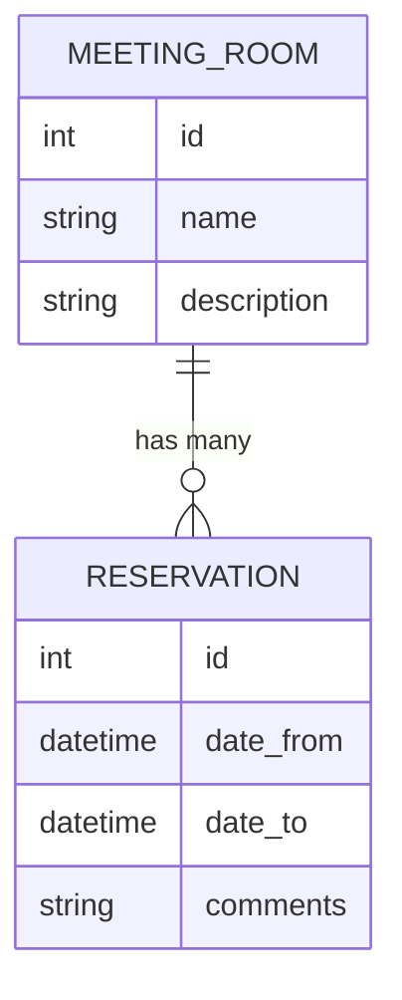

# API бронирования переговорок

Асинхронный сервис на FastAPI для управления переговорными комнатами и будущими бронированиями. Стек минималистичный: Pydantic для валидации, асинхронный SQLAlchemy 1.4 для доступа к БД и Alembic для миграций.

## Технологический стек

- Python 3.10+
- FastAPI и Pydantic
- SQLAlchemy (async engine)
- Alembic и aiosqlite
- Uvicorn (ASGI-сервер) и watchgod для горячей перезагрузки
- python-dotenv для работы с переменными окружения

Полный список версий — в `requirements.txt`.

## Быстрый старт

1. **Клонирование и создание окружения**

   ```bash
   python -m venv venv
   source venv/bin/activate  # Windows: venv\Scripts\activate
   pip install -U pip
   ```

2. **Установка зависимостей**

   ```bash
   pip install -r requirements.txt
   ```

3. **Настройка переменных окружения**

   - скопируйте `.env.example` в `.env` (создайте шаблон, если его нет);
   - задайте `DATABASE_URL`, например `sqlite+aiosqlite:///fastapi.db`.

4. **Запуск миграций**

   ```bash
   alembic upgrade head
   ```

5. **Запуск приложения**

   ```bash
   uvicorn app.main:app --reload
   ```

Интерактивная документация доступна по адресу `http://127.0.0.1:8000/docs`.

## Полезные команды

- `alembic revision --autogenerate -m "message"` — создать миграцию из моделей
- `alembic upgrade head` — применить последние миграции
- `alembic downgrade -1` — откатить последнюю миграцию

## Доступные эндпоинты

- `POST /meeting_rooms/` — создание переговорной комнаты
- `GET /meeting_rooms/` — получение списка переговорных
- `PATCH /meeting_rooms/{meeting_room_id}` — частичное обновление данных
- `DELETE /meeting_rooms/{meeting_room_id}` — удаление переговорной

## Структура проекта

```text
.
├── alembic/                 # Конфигурация и версии миграций
│   └── versions/
├── app/
│   ├── api/                 # Маршруты FastAPI
│   ├── core/                # Настройки, база и инициализация БД
│   ├── crud/                # CRUD-операции
│   ├── models/              # SQLAlchemy-модели
│   └── schemas/             # Pydantic-схемы
├── fastapi.db               # SQLite-БД для разработки
├── README.md
├── requirements.txt
└── alembic.ini
```

## Диаграмма

Рекомендуемый вариант — диаграмма сущностей (ER), показывающая связь между переговорками и бронированиями: одна переговорка может иметь множество бронирований, но каждое бронирование относится к одной конкретной переговорке. Такой набросок можно оформить прямо в README с помощью Mermaid:



## ToDo

- [ ] Завершить CRUD-логику для бронирований (`app/crud/reservation.py`)
- [ ] Реализовать эндпоинты бронирований (`app/api/reservation.py`)
- [ ] Описать модели и схемы Pydantic для бронирований
- [ ] Добавить проверку конфликтов бронирований
- [ ] Расширить README разделами о деплое и архитектуре после внедрения функционала
